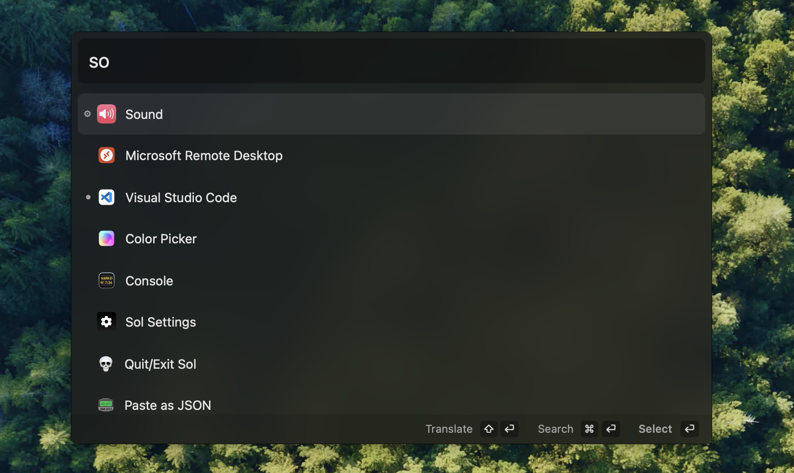

# Sol



<br/>
<div align="center">
  <a align="center" href="https://twitter.com/ospfranco">
    
  </a>
  <br/>
  <br/>
  <a align="center" href="https://www.producthunt.com/posts/sol-2?utm_source=badge-top-post-badge&utm_medium=badge&utm_souce=badge-sol&#0045;2" target="_blank"></a>
</div>

Sol is an open source app launcher, focused on ease of use and speed. It has minimal configuration and runs natively.

[Visit official site](https://sol.ospfranco.com)

## Download

Install via brew

```
brew install --cask sol
```

Or manually download the latest [release](https://github.com/ospfranco/sol/tree/main/releases).

## Discord

Join the Discord

https://discord.gg/W9XmqCQCKP

## Features

- App search
- Custom shortcuts
- Google translate
- Calendar
- Show upcoming appointement in Menu Bar
- Custom AppleScript commands
- Custom links
- Imports browser bookmarks
- Window Manager
- Emoji picker
- Clipboard manager
- Notes Scratchpad
- Retrieve Wi-Fi password
- Show IP address
- Start a google meet
- Switch OS theme
- Process killer
- Clear XCode Derived Data
- Generate NanoID
- Generate UUID
- Generate lorem ipsum
- Format and paste JSON
- Forward media keys to Spotify/Apple Music
- Blacken Menu Bar
- Quickly evaluate math operations

## Contributing

You need to set up your machine for macOS development with React Native. Basically you need to install:

- Xcode
- Node (I suggest you use mise)
- Watchman
- Ruby 3.x (I suggest you use mise again)
- Cocoapods

Follow any of the online tutorials to set up your machine for iOS/MacOS React Native development.

Once you have everything installed run the following commands

```sh
corepack enable # Allows to turn yarn without the need to install it separately
yarn
yarn pods
yarn macos
```

or

```sh
corepack enable
yarn
yarn pods

# and then open the sol.xcworkspace in Xcode and run the app from there
```

App is signed with my personal team, so you will have an error there you can ignore as long as you are not packaging the app. But please don't change it, otherwise your PR will be dirty.

## License

MIT License
