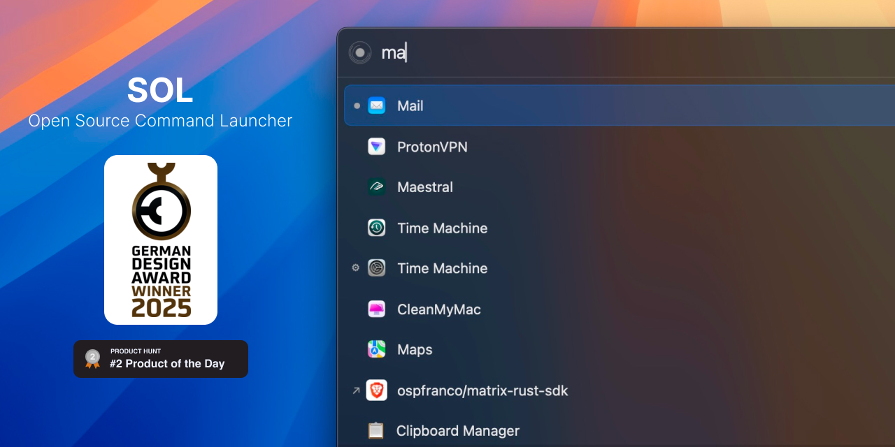

# Sol



<br/>
<div align="center">
  <a align="center" href="https://twitter.com/ospfranco">
    
  </a>
</div>

Sol is an open source app launcher, focused on ease of use and speed. It has minimal configuration and runs natively.

[Visit official site](https://sol.ospfranco.com)

## Download

Install via brew

```
brew install --cask sol
```

Or manually download the latest [release](https://github.com/ospfranco/sol/tree/main/releases).

## Discord

Join the Discord

https://discord.gg/W9XmqCQCKP

## Features

- App search
- Custom shortcuts
- Google translate
- Calendar
- Show upcoming appointement in Menu Bar
- Custom AppleScript commands
- Custom links
- Imports browser bookmarks
- Window Manager
- Emoji picker
- Clipboard manager
- Notes Scratchpad
- Retrieve Wi-Fi password
- Show IP address
- Start a google meet
- Switch OS theme
- Process killer
- Generate NanoID
- Generate UUID
- Generate lorem ipsum
- Format and paste JSON
- Forward media keys to Spotify/Apple Music
- Blacken Menu Bar
- Quickly evaluate math operations
- Script Runner
- Symbolic Link Support

## Contributing

**Two lanes**

- **Local development** — Use **mise** + **Xcode** on your Mac: `mise install` (tools + JS/Ruby deps + pods), copy `src/env.example.ts` → `src/env.ts`, fix signing once if needed, then **`bun macos`**. That path skips Sentry upload and other release-only files on purpose.
- **Publishing / release** — Maintainer-style **`bun release`** / **`bun dev`** (Fastlane) with real `src/env.ts`, `macos/sentry.properties`, App Store credentials, and so on. Not required to contribute.

### First-time setup (from the repo root)

1. **Trust the project** (mise will refuse hooks otherwise):

   ```sh
   mise trust
   ```

2. **Enable mise hooks** once on your machine (the repo uses a `postinstall` hook in `mise.toml`) and ensure mise installs ruby as a precompiled binary to avoid toolchain issues:

   ```sh
   mise settings experimental=true
   mise settings ruby.compile=false
   ```

3. **Install tools and dependencies**:

   ```sh
   mise install
   ```

   This installs Bun and Ruby, then runs: `bun install`, installs Bundler, `bundle install` (root `Gemfile`), and `bun pods` (CocoaPods + SPM resolution for `macos/`).

   If the hook did not run or failed, run the same steps manually:

   ```sh
   bun install
   gem install bundler --no-document
   bundle install
   bun pods
   ```

4. **App env for Metro / the bundle step** — `src/env.ts` is gitignored. Copy the example once per clone (then edit if you use Sentry locally):

   ```sh
   cp src/env.example.ts src/env.ts
   ```

### Run the macOS app

```sh
bun macos
```

That runs `react-native run-macos` against the **debug** scheme with **`SENTRY_DISABLE_AUTO_UPLOAD=true`** so local builds do not require `macos/sentry.properties` or a Sentry org for the “Bundle React Native code and images” phase. If CocoaPods is out of date, you may see missing `Pods-*.xcconfig` errors—run `bun pods` successfully first.

### Hermes / Node (`PhaseScriptExecution` … `No such file or directory` for `node`)

Xcode build phases (including Hermes) use **`NODE_BINARY`** from `macos/.xcode.env`, with an optional override in `macos/.xcode.env.local`. If `NODE_BINARY` points at another machine’s path (for example under `/Users/someoneelse/.local/share/mise/…`), the Hermes script fails with “No such file or directory”.

The repo ships `macos/.xcode.env` with `NODE_BINARY=$(command -v node)`. Do not commit a `.xcode.env.local` with a hardcoded path; that file is listed in `.gitignore` under `macos/`. If you still have a bad local override, delete `macos/.xcode.env.local` or set `export NODE_BINARY=$(command -v node)` there, then run **`bun pods`** so CocoaPods regenerates its scripts. If an old path lingers, clean the build folder in Xcode (Shift-Command-K) or remove this app’s folder under `~/Library/Developer/Xcode/DerivedData/`.

### Code signing (why `bun macos` fails with “No signing certificate … 24CMR7378R”)

The **macOS** target in `macos/sol.xcodeproj` uses **automatic signing** with a fixed **Development Team** (`24CMR7378R`, the maintainer’s Apple Developer team). Unless your Mac has that team’s **Apple Development** / **Mac Development** identity installed, `xcodebuild` stops with error 65 and a message like:

`No signing certificate "Mac Development" found … matching team ID "24CMR7378R"`

That is expected for contributors; it is not a broken Hermes or Pods graph (the long “Target dependency graph” dump is normal).

**Fix once per clone:**

1. Open **`macos/sol.xcworkspace`** in Xcode (use the workspace, not `sol.xcodeproj` alone).
2. Select the **Sol** project → **macOS** target → **Signing & Capabilities**.
3. Set **Team** to your Apple ID (**Personal Team** is fine). Xcode updates `DEVELOPMENT_TEAM` in `project.pbxproj` for your machine.
4. If Xcode says the **bundle identifier** is unavailable (the Debug app ID is tied to the upstream team), open **Build Settings** on the same target, search **Product Bundle Identifier**, and set the **Debug** value to something you own, e.g. `com.yourname.sol.debug` (only needed if signing still fails after choosing your team).
5. Run **`bun macos`** again.

**Pull requests:** If you change team or bundle ID only for local runs, **do not commit** `macos/sol.xcodeproj/project.pbxproj` unless the project maintainers ask you to—keep signing changes local or discuss in the PR first.

### Do not use `sudo` with mise, gems, or CocoaPods

Run `mise install`, `gem`, `bundle`, and `pod` **as your normal user**. Using `sudo mise …` or `sudo gem …` into mise’s Ruby tree will:

- leave root-owned files under `~/.local/share/mise/installs/ruby/…` and break later `gem install` / `bundle install` with permission errors, and  
- make CocoaPods refuse to run (“You cannot run CocoaPods as root”).

If you already did that, repair ownership (adjust the path if your `MISE_DATA_DIR` / install root differs):

```sh
sudo chown -R "$(whoami)" ~/.local/share/mise/installs/ruby
```

Then run `mise install` again **without** `sudo`.

## License

MIT License
